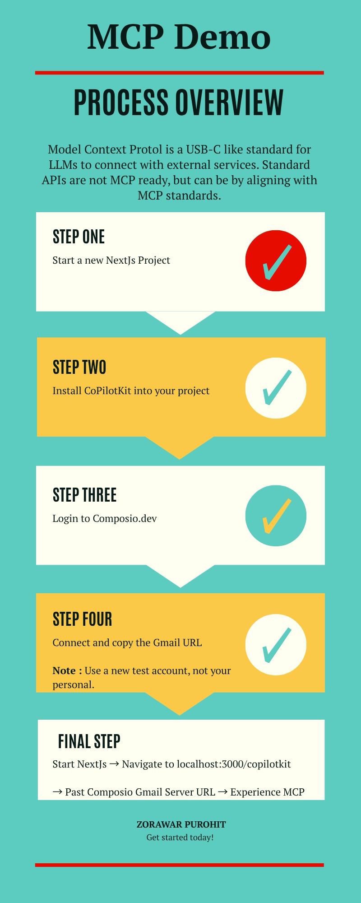

# MCP CopilotKit Demo

This project demonstrates how to use [Composio.dev](https://composio.dev) and [CopilotKit](https://copilotkit.ai) together in a Next.js app.

## 🚀 Getting Started

### 1. Clone the Repository

```bash
git clone <your-repo-url>
cd mcp-copilotkit
```

### 2. Install Dependencies

Use your preferred package manager:

```bash
npm install
# or
yarn install
# or
pnpm install
# or
bun install
```

### 3. Set Up Environment Variables

Create a `.env.local` file in the root directory and add the following:

```env
# MCP (Composio) API URL
MCP_URL=https://api.composio.dev

# Your OpenAI API Key
OPENAI_API_KEY=sk-...

# (Optional) Other environment variables as needed
```

- **MCP_URL**: The base URL for Composio.dev API. Use the default above unless instructed otherwise.
- **OPENAI_API_KEY**: Get your API key from [OpenAI](https://platform.openai.com/account/api-keys).

### 4. Start the Development Server

```bash
npm run dev
# or
yarn dev
# or
pnpm dev
# or
bun dev
```

Visit [http://localhost:3000/copilotkit](http://localhost:3000) in your browser to view the demo.

## 🛠️ Project Structure

- `app/page.tsx` — Main page component.
- `public/` — Static assets.
- `styles/` — CSS and styling.

## ✨ Features

- Integrates [Composio.dev](https://composio.dev) for workflow automation.
- Uses [CopilotKit](https://copilotkit.ai) for AI-powered features.
- Built with [Next.js](https://nextjs.org) for fast development and deployment.

## 📚 Learn More

- [Composio.dev Documentation](https://docs.composio.dev)
- [CopilotKit Documentation](https://docs.copilotkit.ai)
- [Next.js Documentation](https://nextjs.org/docs)

## 🤝 Contributing

Feel free to open issues or submit pull requests!

